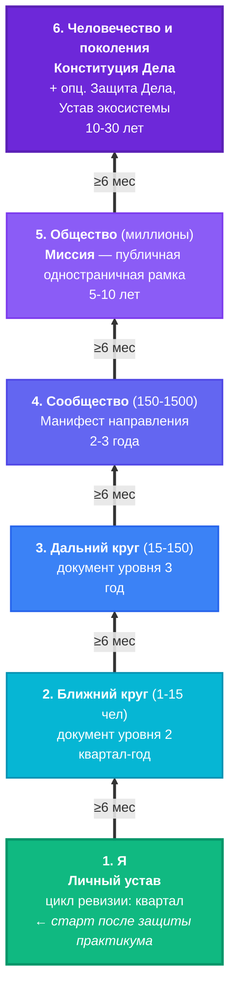

# Иллюстрация: Lifework-пакет — 6 уровней охвата

> Шесть инвариантных документов созидателя, по одному на каждый уровень охвата. Подъём идёт **снизу вверх** через gate ≥6 мес устойчивой практики предыдущего уровня. Время жизни документа растёт вместе с уровнем — от квартала на уровне 1 до 10-30 лет на уровне 6.

## Основная схема

## Сравнительная таблица

| Уровень | Охват | Инвариантный документ | Цикл ревизии |
|---------|-------|----------------------|--------------|
| **1** | Я | **Личный устав** — как живу: ритм, методы, инварианты ресурса, чем не занимаюсь | квартал |
| **2** | Ближний круг (1-15) | Документ уровня 2 (договорённости с близкими, ритм семьи) | квартал-год |
| **3** | Дальний круг (15-150) | Документ уровня 3 (профессиональные обязательства, рабочая рамка) | год |
| **4** | Сообщество (150-1500) | Манифест направления | 2-3 года |
| **5** | Общество (миллионы) | **Миссия** — публичная одностраничная рамка | 5-10 лет |
| **6** | Человечество и поколения | **Конституция Дела** + опционально Защита Дела, Устав экосистемы | 10-30 лет |

## Три ключевых различения

**1. Lifework как зонтик ≠ Lifework как уровень 6.**
«Lifework» — имя всего пакета (6 уровней). «Конституция Дела» — документ уровня 6, не «весь Lifework». Пакет начинается с Личного устава, а не с Конституции.

**2. «Дело» ≠ «Работа» ≠ «Профессия» ≠ «Миссия».**

| Слово | Уровень |
|-------|---------|
| Работа | 3 |
| Профессия | 3-4 |
| Миссия | 5 |
| Дело (в сильном смысле — переживёт основателя) | 5-6 |

Использовать «Дело» на уровнях 1-3 — преждевременно. На уровнях 1-3 это «работа», «профессия», «занятие».

**3. Подъём ≠ Имитация подъёма.**
- **Подъём:** документ уровня N-1 работает ≥6 месяцев устойчивой практики → составление уровня N.
- **Имитация:** «написать Конституцию» с уровня 1, потому что выглядит престижно.
- **Тест:** «можешь описать конкретные решения, которые ты принял за последние 6 месяцев против инвариантов уровня N-1?» Нет → подъём преждевременен.

## Что такое gate ≥6 месяцев

Между уровнями стоит строгий **gate**: чтобы получить право составлять документ уровня N, документ уровня N-1 должен работать ≥6 месяцев устойчивой практики. Документ ловит **уже сложившийся** паттерн, а не желаемый: сначала живёшь так, потом фиксируешь.

Это защищает от двух частых ошибок:
- **«Mission-first» подход** (Sinek «Start with Why») — обратная логика: метод утверждает, что Конституция Дела (уровень 6) появляется как **следствие** пройденных уровней 1-5, а не как стартовая точка
- **Подгонка практики под шаблон** — нельзя «написать красивую Конституцию» в надежде, что жизнь подтянется. Связь односторонняя: жизнь → документ, не наоборот

## Время жизни документа

Растёт с уровнем. Это намеренно:

| Уровень | Цикл | Логика |
|---------|------|--------|
| 1 | квартал | Личная жизнь меняется быстро (ритм, состояние, методы) |
| 2-3 | квартал — год | Ближний и дальний круги меняются медленнее |
| 4 | 2-3 года | Сообщество стабилизируется на этом горизонте |
| 5 | 5-10 лет | Миссия — позиция в обществе, не должна метаться |
| 6 | 10-30 лет | Конституция — для преемников, протокол изменения требует времени и согласия |

## Защита практикума в этой картине

**Защита практикума «Методы саморазвития» = старт уровня 1.** Через 6+ месяцев устойчивой практики (учёт времени, ритм, неудовлетворённости, стратегические сессии) Личный устав v0.1 оформляется явно. Только после этого открывается право думать про уровень 2 (ближний круг).

Программа ЛР Aisystant целится в **устойчивый уровень 1** — это уже большая работа. Некоторые созидатели всю жизнь работают на уровнях 1-3, и это **завершённая работа**, а не «застряли».

## Где это применяется

- **Занятие 9 «Планирование + подготовка к защите»** — Lifework-пакет даёт картину «куда идёт развитие после практикума»
- **Различение «защита = первый шаг к Личному уставу»** — связь практикума с долгосрочной траекторией созидателя
- **Калибр недели по 6 уровням охвата (PD.FORM.090)** — план недели проектируется с учётом, на каком уровне работают РП
- **Двойной gate Дисциплинированный → Проактивный (PD.FORM.080 §7.1)** — не только метрики, но и **мировоззренческий сдвиг** (готовность к уровню 2+)

---

*Источник: метод [PD.METHOD.018 Сборка пакета Lifework по уровням охвата](https://github.com/aisystant/PACK-personal/blob/main/pack/personal-development/03-methods/PD.METHOD.018-lifework-pack-composition.md). Метод выведен из единственного пакета автора (Тсерен Тсеренов, домен «Системное созидательство», 11 лет работы); универсальность — гипотеза, требующая внешней валидации. Структура 6 уровней охвата опирается на эмпирические якоря (Dunbar, Singer, Bronfenbrenner, Kegan) и не специфична для одного автора. Шаблоны конкретных документов (Конституция, Миссия и др.) вытащены из документов автора.*
