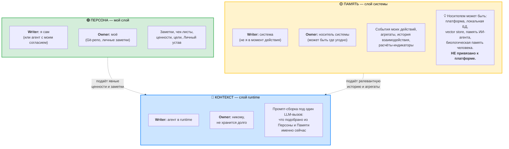
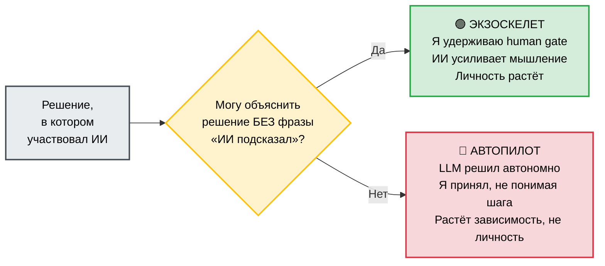

# Иллюстрация: Три слоя экзокортекса

> Критерий разделения = **кто пишет** (writer) + **кому принадлежит** (owner). Не «ближе/дальше к мозгу», не «свежее/старее», не «семантическое/эпизодическое». Только эти две оси.

## Основная схема

## Сравнительная матрица

| Слой | Writer (кто пишет) | Owner (кому принадлежит) | TTL | Контролирую ли я? |
|---|---|---|---|---|
| **Персона** | Я сам | Моё | Постоянно | Да: могу прочитать, изменить, удалить |
| **Память** | Система автоматически | Носитель системы | От события до удержания носителя | Зависит от носителя: на моём ноуте — да, на чужой платформе — по политике сервиса |
| **Контекст** | Агент в runtime | Никому | До конца LLM-вызова | Косвенно: через промпт и инструкции агенту |

## Тест границы

> **«Что пропадёт, если удалю X?»**

- Удалил Git-репо со своими заметками → пропала **Персона**.
- Удалил Neon БД (или локальную SQLite, или историю чатов в ChatGPT) → пропала **Память**.
- Прервал LLM-вызов → пропал **Контекст**.

Если три ответа сходятся в одну точку («у меня есть Notion и больше ничего») — у вас всё в одном слое, и при потере носителя теряется сразу всё.

## Зачем различать

Когда ИИ «знает обо мне», вопрос «откуда» имеет три разных ответа:

1. Из **Персоны** — я сам положил, могу удалить, я владею.
2. Из **Памяти** — система записала автоматически. Где носитель? Какая политика? Кто ещё видит?
3. Из **Контекста** — это сборка именно сейчас, исчезнет с концом сессии.

Без этого различения разговор «у меня есть второй мозг» превращается в туман. Метафора «второй мозг» плоская: она прячет, **где** моё, а где **системы**.

## Где это применяется

- **Урок ss-lesson-08** Блок 5 (актуализирован 26 апр) — основа разговора про «ИИ как часть экзокортекса».
- **HD #27** в `~/IWE/.claude/rules/distinctions.md` — полное описание с edge cases.
- **DP.D.050** в PACK-digital-platform — формальное определение слоёв.
- **WP-257** — РП, в котором замена legacy-термина «ЦД» на три слоя была спроектирована.

## Парная иллюстрация: Экзоскелет ≠ Автопилот (DP.D.046)

> Слоистая модель отвечает на «**где** моё». Различение «экзоскелет vs автопилот» — на «**в каком режиме** я работаю с этим всем».

**Связка:** удерживать human gate проще, когда понимаешь, **из какого слоя** ИИ взял аргументы для совета. Если из Персоны (моё) — я могу проверить источник. Если из Памяти системы — спросить, что именно было подобрано. Если только из Контекста — это его собственная сборка, которую я могу принять или отклонить.

---

*Источник: PD.FORM.080-091 (PACK-personal), DP.D.046, DP.D.050 (PACK-digital-platform), HD #27 (~/IWE/.claude/rules/distinctions.md, 22 апр 2026).*
