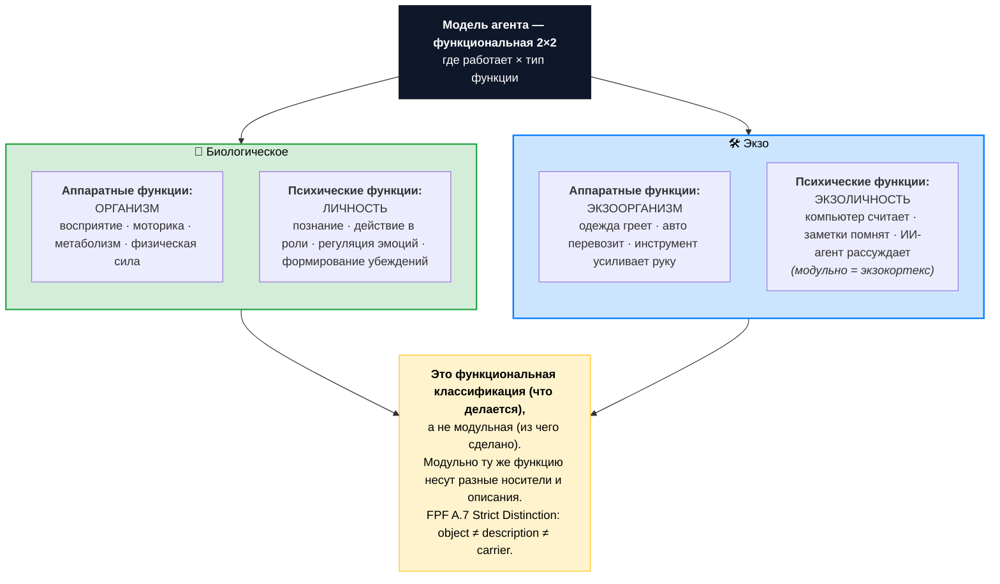

# Иллюстрация: Модель агента — функциональная 2×2

> Четыре функциональных категории — что и как агент делает. Две оси: **где работает функция** (биологическое vs экзо) × **тип функции** (аппаратная vs психическая). Это **функциональное** разбиение (что делается), не модульное (из чего сделано).

## Основная схема

## Сравнительная матрица

| Где работает | Аппаратные функции | Психические функции |
|---|---|---|
| **Биологическое** | **Организм** — восприятие, моторика, метаболизм | **Личность** — познание, действие в роли, регуляция эмоций |
| **Экзо** | **Экзоорганизм** — расширение физических возможностей | **Экзоличность** (= экзокортекс модульно) — расширение психических возможностей |

## Тест границы — две границы вместо одной

**Биологическое vs Экзо:** «Получено при рождении или приобретено?»
- Тело и мозг — биологическое (даны при рождении, не передаются).
- Заметки в Notion, MacBook, ИИ-агент — экзо (приобретены, передаваемы).

**Аппаратные vs психические функции:** «Что эта функция делает — двигает физическим миром или работает с информацией?»
- Восприятие, моторика, метаболизм, носить груз — аппаратные.
- Познание, регуляция, мастерство, рассуждение — психические.

## Функциональное ≠ модульное (FPF A.7 Strict Distinction)

**Функциональная категория** говорит, *что делается*. **Модульная** — *из чего сделано*. На одной таблице их нельзя смешивать (это нарушает A.7: object ≠ description ≠ carrier).

| Функция | Модульная реализация |
|---|---|
| **Организм** (аппаратные функции био) | Биологическое тело: мышцы, нервная система, мозг как орган |
| **Личность** (психические функции био) | То же био-тело + информация в нейронных связях (мастерства, образы, убеждения) |
| **Экзоорганизм** (аппаратные функции экзо) | Физические инструменты: одежда, автомобиль, ручной инструмент |
| **Экзоличность** = **Экзокортекс** (психические функции экзо) | Компьютер с программами + заметки + ИИ-модели — целостная сборка из носителя и описания |

«Экзокортекс» в практикуме — устоявшееся имя для модульной сборки, реализующей экзоличность.

## Плоская 4-компонентная развёртка для практики

В упражнении удобнее по строкам, чем по матрице:

| Функциональный компонент | Что развиваем |
|---|---|
| **Организм** | Здоровье, сон, движение, восстановление |
| **Личность** | Мастерства, мировоззрение, регуляция эмоций |
| **Экзоорганизм** | Ресурсы, инструменты, среда |
| **Экзокортекс** | Записи, заметки, ИИ-агенты, инструменты мышления |

Это те же четыре квадранта, развёрнутые в плоский список. Не альтернативная онтология, а проекция для удобства самооценки.

## Зачем разделение аппаратных и психических функций

Каждый функциональный квадрант развивается **разными методами**:
- **Организм** — сон, питание, движение, отдых (методы для тела).
- **Личность** — обучение, тренировка мастерств, рефлексия (методы для психики).
- **Экзоорганизм** — заработать, купить, обустроить (методы для физических ресурсов).
- **Экзокортекс** — настроить, описать, обучить ИИ-агента, освоить инструмент (методы для информационных ресурсов).

Если перепутать функции — будете тренировать тело там, где нужна настройка инструмента. Один из самых частых перекосов: пытаются «улучшить экзокортекс деньгами» (купить ещё одну подписку), когда нужно описать процесс или собрать систему заметок.

## Где это применяется

- **Занятие 8 «Личность и агент, человек и ИИ»** — основа модели агента в практикуме.
- **Различение «биологическое тело vs экзотело»** — фундаментальное различение в каноне развития.
- **6 направлений саморазвития** — направление «Инструменты» объединяет экзоорганизм + экзокортекс как одно поле работы (с двумя разными методами).

---

*Источник: формализация «Модель агента» (функциональная 2×2 декомпозиция: биологическое + экзо × аппаратные + психические функции). FPF A.7 Strict Distinction.*
