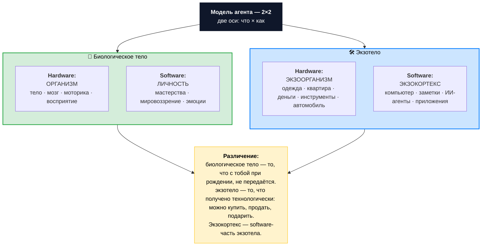

# Иллюстрация: Модель агента 2×2

> Две оси одновременно: **что** (биологическое тело vs экзотело) × **как** (hardware vs software). Четыре квадранта. Экзокортекс — software-часть экзотела, не отдельный пятый компонент.

## Основная схема

## Сравнительная матрица

| Модуль | Hardware (аппаратная часть) | Software (программная часть) |
|---|---|---|
| **Биологическое тело** | **Организм** — тело, мозг, моторика | **Личность** — мастерства, мировоззрение, эмоции |
| **Экзотело** | **Экзоорганизм** — одежда, квартира, деньги, инструменты | **Экзокортекс** — компьютер, заметки, ИИ-агенты |

## Тест границы

> **«Получено при рождении или приобретено?»**

- Тело и мозг — **биологическое тело** (даны при рождении, не передаются).
- Заметки в Notion, MacBook, ChatGPT-аккаунт — **экзотело** (получены технологически, передаваемы).
- Внутри экзотела: одежда и стол — экзоорганизм (физические расширения), а Notion и ИИ-агенты — экзокортекс (когнитивные расширения).

## Плоская 4-компонентная развёртка для практики

В упражнении удобнее по строкам, чем по матрице:

| Компонент | Что включает |
|---|---|
| **Организм** | Тело, здоровье, физические возможности |
| **Личность** | Мастерства, мировоззрение, интеллект |
| **Экзотело** (экзоорганизм) | Одежда, квартира, деньги, ресурсы |
| **Экзокортекс** | Записи, заметки, ИИ, инструменты мышления |

Это та же модель — четыре квадранта 2×2, развёрнутые в плоский список. Не альтернативная онтология, а проекция для удобства самооценки.

## Зачем разделение Hardware vs Software

Каждый квадрант развивается **разными методами**:
- **Организм (HW био-тела)** — сон, питание, движение, отдых.
- **Личность (SW био-тела)** — обучение, тренировка мастерств, рефлексия.
- **Экзоорганизм (HW экзотела)** — заработать, купить, обустроить.
- **Экзокортекс (SW экзотела)** — настроить, описать, обучить ИИ-агента, освоить инструмент.

Если перепутать — будете тренировать тело там, где нужна настройка инструмента. Один из самых частых перекосов: пытаются «улучшить экзокортекс деньгами» (купить ещё одну подписку), когда нужно описать процесс или собрать систему заметок.

## Где это применяется

- **Занятие 8 «Личность и агент, человек и ИИ»** — основа модели агента в практикуме.
- **Различение «биологическое тело vs экзотело»** — фундаментальное различение в каноне развития.
- **6 направлений саморазвития** — направление «Инструменты» объединяет экзоорганизм + экзокортекс как одно поле работы.

---

*Источник: формализация «Модель агента» (модульная 2×2 декомпозиция: биологическое тело + экзотело × hardware + software).*
