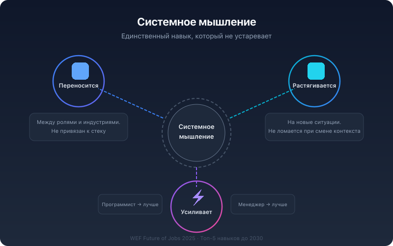

# Системное мышление — навык №1 для рабочей силы 2026

Полгода назад я бы сказал: «Системное мышление — важно, но попробуй объяснить это HR-директору». А сейчас HR-директора сами ищут людей с этим навыком. Что изменилось?

## Мир признал то, что мы знали давно

WEF Future of Jobs Report 2025 поставил аналитическое и системное мышление в топ-5 навыков до 2030 года. Но это не просто очередной рейтинг — за ним стоит конкретный сдвиг на рынке.

**Срок годности навыков сжался.** Раньше навык жил 10–15 лет. Сейчас — 3–5. McKinsey и LinkedIn фиксируют: разрыв между тем, что люди умеют, и тем, что от них требуют, расширяется быстрее, чем компании успевают переучивать. Корпоративные программы обучения запаздывают, потому что построены на старой модели: научил один раз → работает годами.

Компании не могут переучивать людей каждые три года. Им нужны навыки, которые не устаревают.

**Роли требуют 50/50.** AI, data, cloud — с одной стороны. Лидерство, адаптивность, суждение — с другой. Штаты (США) уже создают координированные экосистемы навыков: образование + работодатели + служба поддержки рабочей силы, связанные через данные о рынке труда в реальном времени. AI literacy, problem-solving и creative thinking встраиваются в каждую программу — не как отдельный курс, а как базовый слой.

Компании ищут не «программистов» и не «менеджеров», а людей, которые совмещают оба класса способностей.

**И тут системное мышление оказывается единственным навыком, который работает в обоих мирах.** Потому что оно:

- **Переносится** между ролями и индустриями. Инженер переходит в продукт, менеджер — в стратегию. Навык не привязан к стеку, языку или домену. Именно поэтому WEF называет его одной из самых ценных долгосрочных способностей: он позволяет людям двигаться внутри компании, а не быть вытесненными.

- **Растягивается** на новые ситуации. Большинство навыков ломаются при смене контекста. Знание Python не помогает вести переговоры. Опыт в маркетинге не переносится в R&D. А системное мышление — это мета-навык: умение видеть структуру любой ситуации, независимо от домена.

- **Усиливает** другие навыки. Программист с системным мышлением проектирует лучшую архитектуру. Менеджер — принимает решения, учитывая последствия второго и третьего порядка. Предприниматель — строит бизнес как систему, а не как набор тактик. Системное мышление не конкурирует с другими навыками — оно их мультиплицирует.

## Рынок подтверждает деньгами

Рынок EdTech переживает то, что OpenFieldX называет «Efficacy Reckoning» — расплату за эффективность.

Глобальное EdTech-финансирование упало с $20.8B в 2021 году до $2.4B в 2025. 36% EdTech-организаций в K-12 сегменте сообщили о падении выручки — против 28% годом ранее и 18% двумя годами ранее. Тренд однозначный.

Инвесторы больше не верят в метрики вовлечённости. Теперь спрашивают:

- Какой **измеримый результат** обучения? Не «10 млн пользователей», а «X% подтверждённых навыков».
- Какие навыки **верифицированы** — не сертификатом-бумажкой, а оценкой работодателя?
- Какой процент внутренней **мобильности** или трудоустройства?

При этом рынок workforce upskilling растёт на 44.8% CAGR (2026–2034). Корпоративные покупатели инвестируют в micro-credentials и simulation-based training. Interoperability из «хорошей практики» стала **требованием при закупке** — buyer'ы отказываются от платформ, которые не интегрируются с их LMS и HR-системами.

Им нужен не контент — им нужен результат. И результат измеряется в развитии способностей, а не в часах на платформе.

## Почему это касается каждого

Я занимаюсь развитием системного мышления 10+ лет. 5400+ документов в фреймворке корректности (FPF). Не курсы, не видеолекции — операционный фреймворк, который работает с мышлением человека.

Разница между тем, что делает типичный EdTech, и тем, что делаем мы:

- **Традиционный EdTech** продаёт контент и меряет completion rates. «10 000 видеоуроков» — это библиотека, а не развитие.
- **IWE** развивает мышление и меряет характеристики через цифровой двойник. Не сколько часов посмотрел — а как изменились способности.

Системное мышление нельзя выучить по видео. Нужна среда, которая работает с твоим мышлением — как тренажёрный зал работает с телом. Видео — это ютуб-ролик про жим лёжа. Полезно, но не заменяет штангу.

Мир наконец это признал. Теперь вопрос — кто и как будет это развивать.

---

Источники:
1. WEF Future of Jobs Report 2025 — https://www.weforum.org/publications/the-future-of-jobs-report-2025/
2. 2026 EdTech Trends: The Efficacy Reckoning (OpenFieldX) — https://openfieldx.com/edtech-trends-2026/
3. Upskilling vs Reskilling: What Your Learning Strategy Should Focus on in 2026 (Upside Learning) — https://blog.upsidelearning.com/2025/12/22/upskilling-vs-reskilling-what-your-learning-strategy-should-focus-on-in-2026/
4. The Six Biggest Shifts in Professional Upskilling in 2026 (UNIVAD) — https://www.univad.org/post/the-six-biggest-shifts-in-professional-upskilling-in-2026
5. Work Transformation: Skills, Agility, Growth (WEF) — https://www.weforum.org/stories/2025/12/work-transformation-skills-agility-growth/
6. EdTech Funding News 2026 Trends (Talks Android) — https://talksandroid.com/edtech-funding-news-2026-trends/
