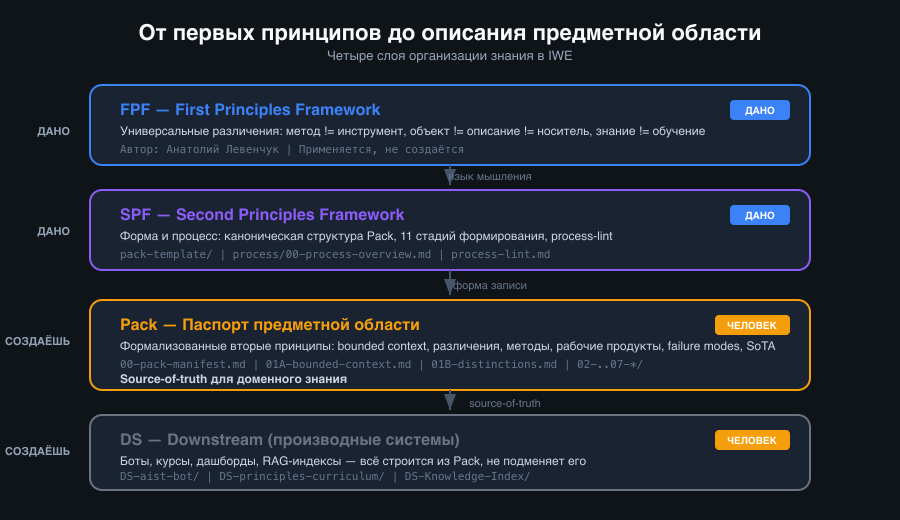

# Как формируются профессиональные знания: от первых принципов до описания предметной области

У каждого сильного профессионала есть картина своей области: что здесь важно, какие различения нельзя путать, какие ошибки типичны. Проблема в том, что эта картина обычно неявная — она живёт в опыте, а не в системе.

В эпоху ИИ это становится критичным. Без формализованной структуры знания ИИ закрепляет путаницу вместо того, чтобы помогать. Я столкнулся с этим сам: чем больше ИИ «помогал», тем больше мусора накапливалось — пока я не начал формализовать знания по-другому.

## Три слоя: что дано и что создаёшь сам

В IWE знание организовано в три слоя. Первые два — даны, последние два — создаёшь сам.

**Нулевые и первые принципы (FPF).** Универсальные различения, верные для любой области. Метод ≠ инструмент. Объект ≠ описание ≠ носитель. Знание ≠ обучение. Они существуют до любой формализации — FPF (First Principles Framework, автор — Анатолий Левенчук) делает их явными и нормативными. Ты не создаёшь первые принципы — ты их применяешь.

**SPF (Second Principles Framework).** Фреймворк-шаблон для вторых принципов. Задаёт каноническую структуру и процесс формирования. SPF одинаков для всех областей — меняется только содержание. Ты тоже не создаёшь SPF — используешь его как форму.

**Pack (Паспорт предметной области).** Здесь начинается твоя работа. Pack — это формализованные вторые принципы конкретного домена: что здесь реально важно, какие различения критичны, какие типовые ошибки. Ты сам выбираешь область, сам формулируешь различения, сам наполняешь Pack содержанием — по форме SPF и с опорой на принципы FPF.

**DS (Downstream).** Производные системы: боты, курсы, дашборды. Тоже создаёшь сам, но они всегда опираются на Pack как на источник истины.

FPF даёт язык мышления → SPF даёт форму записи → Pack фиксирует знание → DS строит на его основе.

## Как формируется Pack: три фазы

### Фаза 1. Границы — определить, о чём этот Pack

Самая важная фаза. Без неё всё остальное — складывание информации в папку.

**Что делает человек:**
- Выбирает **домен** — не тему, а предметную область с границей. «Цифровая платформа» — домен. «Всё про IT» — нет.
- Фиксирует **bounded context** — что внутри, что снаружи, определения терминов, семантические различия между похожими понятиями.
- Создаёт **различения** — пары «A ≠ B» с тестом проверки. Например: «AI-система ≠ IT-система. Тест: зависит ли от LLM-инференса?» Различения — это фильтр для всей дальнейшей работы.

**Результат:** три файла — `00-pack-manifest.md` (паспорт), `01A-bounded-context.md` (семантический контракт), `01B-distinctions.md` (различения).

### Фаза 2. Наполнение — формализовать знание по шаблонам

**Что делает человек:**
- Описывает **domain entities** — что существует в домене: роли, объекты внимания, характеристики.
- Формулирует **методы** — способы действия (не сценарии, не «шаг 1, шаг 2»).
- Определяет **рабочие продукты** — проверяемые результаты методов.
- Фиксирует **failure modes** — типовые ошибки интерпретации.
- Расставляет **SoTA-статусы** — актуальность каждого утверждения (current / hypothesis / deprecated).

**Что делает система:**
- Валидирует формат через process-lint (нет дидактики? не путаем типы?).
- Генерирует ID, шаблоны, индексы.
- Проверяет дубликаты и ссылки.

**Результат:** папки `02-domain-entities/`, `03-methods/`, `04-work-products/`, `05-failure-modes/`, `06-sota/`, `07-map/` — наполненные формализованным знанием.

### Фаза 3. Эволюция — поддерживать Pack живым

Pack — не «написал и забыл». На каждом рубеже работы происходит цикл:

**Что делает система:**
- Обнаруживает кандидатов на извлечение знания (экстрактор).
- Маршрутизирует: доменное → Pack, реализационное → DS.
- Проверяет SoTA-актуальность, находит битые ссылки.
- Строит downstream: курсы, боты, RAG-индексы — из стабильного Pack.

**Что делает человек:**
- Подтверждает или отклоняет извлечение.
- Пересматривает различения при изменении понимания области.
- Обновляет SoTA-статусы.

Процесс не линейный — ревизия может вернуть на любую предыдущую фазу.

## Почему Pack — это не wiki и не конспект

Два человека с одинаковым SPF, но разными Pack'ами получат разную картину знания из одного и того же источника. Pack уникален, потому что определяется:
- **Bounded context** — что входит в домен, а что нет.
- **Различениями** — какие категории критичны именно здесь.
- **Профессиональным опытом** — какие failure modes ты видел на практике.

Экстрактор без Pack'а — пустой классификатор. Он знает *как* сортировать, но не знает *во что*. Pack задаёт систему координат.

## Где этому учиться

Формирование Pack — учебный результат фазы 4 (Автономия) программы «Личное руководство». Не просто «упоминается» — это gate-критерий: участник создаёт Pack с ≥10 сущностями, прошедший peer-review.

Но путь к этому постепенный:
- **Фаза 1** — основы: учёт времени, чтение, мировоззрение.
- **Фаза 2** — различения: системное мышление, письмо, экзокортекс.
- **Фаза 3** — созидание: стратегия, IWE, введение в Pack.
- **Фаза 4** — автономия: полное формирование Pack, peer-review, передача другим.

Каждая фаза готовит к следующей. Нельзя формировать Pack без различений (фаза 2), а различения не работают без базовой культуры внимания (фаза 1).
