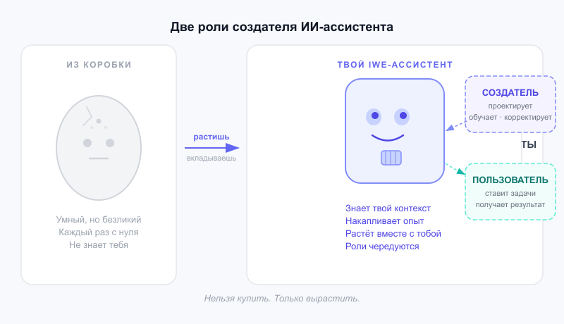

# Персональный ИИ-ассистент не выдаётся из коробки — его нужно вырастить

Когда ChatGPT только вышел и я начал с ним работать, у меня было ощущение, что вот оно, наконец инструмент, который всё понимает. Но потом стало очевидно: он не знает, кто я, не помнит вчерашний разговор, не знает мои проекты. Каждый раз с нуля. Он, конечно, адаптируется и начинает что-то помнить, но именно что-то, а не то, что нужно.

Первоначально казалось, что это проблема модели и вендоры скоро разберутся и сделают правильную память. Что следующая версия будет лучше. Но потом понял, что жду не того.

Для объяснения приведу аналогию с игрушкой из 90-х — тамагочи. Маленький экран, несколько кнопок, пищащий питомец. Ты не получал готового питомца, ты получал яйцо. Кормил, играл, следил за здоровьем. Питомец рос в зависимости от того, как ты с ним обращался. Забрасывал — деградировал. Вкладывал — рос. И у тебя было две роли: ты его формировал и ты им пользовался. Одно без другого не работало.

С персональным ИИ-ассистентом, вероятно, будет то же самое, только ставки выше и личные вложения потребуются значительные. Особенно, если хочется получить профессионального агента, а не игрушку.

Последние пару месяцев я строю IWE — Intellectual Work Environment, среду для интеллектуальной работы. Аналог IDE, только не для программирования, а для мышления и проектов. Внутри работает Claude (или другие LLM), который знает моё ядро знаний и каждый раз может собирать необходимый контекст: мои проекты, принципы, как я принимаю решения, мои неудовлетворённости, проекты и тп. Он работает в разных ролях в зависимости от задачи.

Это не настроилось само. Я вкладываю в это время: пишу инструкции, формализую знания о своей области, корректирую ассистента, когда он ошибается. Когда понимаю что-то новое о своей работе, то записываю, чтобы он это учёл. Это одна роль. Другая — просто работать вместе с ним: ставить задачи, двигать проекты, получать результат.

Первое время я застревал в первой роли: бесконечно настраивал и почти не пользовался. Потом качнулся в другую сторону: много просто работал, мало что обновлял. Сейчас они чередуются. Инвестировал час на развитие — потом несколько дней работаю быстрее. Но чаще всё происходит параллельно, а я просто условно понимаю разницу, потому что я делаю IWE только для себя, а ещё как шаблон для других.

Сейчас с IWE я работаю совсем иначе, чем год назад. Не потому что Claude стал умнее, хотя и это тоже. А потому что мой IWE стал умнее и задаёт совсем другую культуру работы. Это то, что не купить как товар. Только вырастить.

